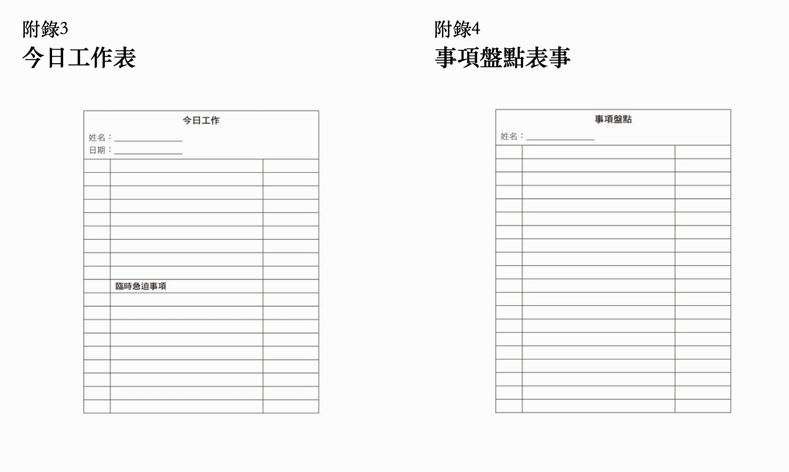

<!-- 
* 总是会先写一句话，同步背景和上下文
* 评论式写作引用一些大牛说的话
* 多一些有趣的跳转链接
* 在文章末尾推荐一些有趣的链接
* 先写提纲，再写内容 -->

> 对于我还来说，很容易陷入一种工作一整天，一整天都很忙但是不知道在忙什么的状态，导致第二天还是很焦虑，早会还是不知道要讲什么，只能做一下让自己感觉能说的事情。

<!-- 如果你为一个任务设置了一个番茄钟，但是提早完成了，比方说你为一本书的某个章节记笔记，但你提早完成了 - 你不应该立即进入到下一个任务，或者提早结束这个番茄钟。
如果你这么做了，你便还是在于时间抗争，并且幻想着某天能够完全掌控它。
取而代之地，使用剩下的时间去回顾你的工作，试着让你那迫不及待去做下一个任务的焦虑心情平复下来。 -->

为了解决这个问题，我想了特别多种方法，例如每天写个 TODO list，但是还是会被各种中途插入的事情所浪费很多时间导致自己原来所列的 TODO list 里面的任务都没有办法很好的完成。于是我拿出了我在大学时候一直使用的番茄工作法来应用到我的工作中，同时也看了一些相关的书籍例如《间歇高效率的番茄工作法》。有了一些见解，就用这篇文章来说说下我的番茄工作法。

## 什么是番茄工作法？

番茄工作法是由弗朗西斯科·西里在 1992 年创立的时间管理法则。使用一个定时器分割出 25 分钟时间作为工作时间，和 5 分钟的休息时间，这些时间段会被称为 pomodoros。

### 目的

使用番茄工作法的目的是辅助你更好的更高效的管理你自己的时间，同时减轻你对于不想做的事情的焦虑，让你更好规划时间，同时尽可能的让你减少被他人打断而造成的上下文切换的次数。

## 几项原则

番茄工作法虽然表面上是每工作 25 分钟，就可以休息 5 分钟，但是实际上番茄工作法还是有一些原则的，这些原则是我们在使用番茄工作法的时候要遵守的。

* 对于任务的拆解，对于一个比较大的任务，我们会对它进行估算，预计用几个番茄钟能完成它。一旦一个任务的预计时间超过 5 - 7 个番茄钟，我们就会对它进行拆解，拆解成小于 5 个番茄钟的子任务。这样的好处是我们不会因为一个任务过于庞大而望而却步，将任务拆细一个个解决它就是了。

* 对于一个任务如果在一个番茄钟内完成，并且还剩下一些时间，我们不会立刻去做其他任务，而是会去回顾刚刚完成的任务，把这个事情更加尽善尽美的完成。

* 在估算番茄钟的时候，我们会发现有很多细小的任务，类似写个短邮件呀什么的，这个时候我们会把它们凑成一个番茄钟。

## 如何实践？

首先你可以搞一张电子表格或者是纸质的，虽说番茄工作法的作者是会用纸质的方式来搞，但是其实对我来说只要思路对了就行了。

### 估算任务&拆解任务

**估算和拆解任务**在一天的开始的时候，我们会在今日工作表中列出今天要做的任务，按照优先级由高到低。并且对于每个任务，我们会对它进行估时，只需要估算出对于每个任务我们需要多少个番茄钟就可以了。同时运用上面的原则，对于较大的任务拆解成小任务，对于对于小于 1 个番茄钟的任务我们把它们凑成一个番茄钟。

### 正在番茄中

**记录你的想法**：当你正在番茄钟的里面的时候，你可能心里突然灵感爆发，或者突然想到一件事情，对于这些想法，我们会把它们放在一个列表中，也就是事项盘点列表。当你把这个想法写到这个列表中之后，你就可以立马回到你当前的任务中。倘若这个想法对你来说很重要，那你就可以把它放到今日工作表中，这样你就可以把它放到今日工作表中。在这个番茄钟结束之后下一个番茄钟就开始做这件事。

**25 分钟之后回复你**：在很多时候，工作中的打扰不可避免，如果你在 office 中，很多人甚至会来你的工位找你，我这边的建议是友好的回复我在忙，你可以稍等一下，我会尽快回复你的。更好的做法是，最大化你当前任务的窗口来挡住不断闪烁的电脑状态栏，每隔一段时间去检查它。同时我在阅读 Marc Andreessen 的《个人效率指南》的时候，看到了一个很好的办法：
> **藏在耳机中**：工作生活中避免打扰的最好方式就是戴耳机。人们，出于某种原因，觉得打扰一个戴耳机的人会更有负罪感。这很棒，大多时候人们会走到你面前、跟你说话、注意到你戴的耳机、然后用很夸张的嘴型道歉、走开。这个好处是，大多时候人们跟你说话并不是真的有什么事情，而另一些时候，他们完全可以给你发邮件，而你可以稍晚统一处理。所以你不需要听外部的任何事情，甚至耳机的另一头也不需要连任何东西。

**重新估算你的任务**：很多时候我们会遇到你乐观地估算了一个任务所消耗的番茄数目，在消耗完这个任务的所有番茄之后，你可以重新的估计剩下完成这个任务的番茄数目，然后对于这些番茄你可以用不同的标记来记录它。

## 一些最佳实践

**摆脱再过 5 分钟就好**：在践行番茄工作法的时候，我会带着一个老毛病，就是在番茄完成了之后，我会再想着让我再搞 5 分钟，5 分钟就能完成这个任务，但是很多时候我又多花了半个小时，并且卡在了一个步骤浪费了很多时间。这边的最佳实践是，当你完成了一个番茄钟之后，就不要想着继续再搞几分钟，**下一个番茄钟会更好**。间歇性的休息能让你更好的梳理思路。

## 书籍推荐

* [《間歇高效率的番茄工作法》](https://book.douban.com/subject/35119866/)

* [《个人效率指南》](https://pmarchive.com/guide_to_personal_productivity.html)

3x2 原则
