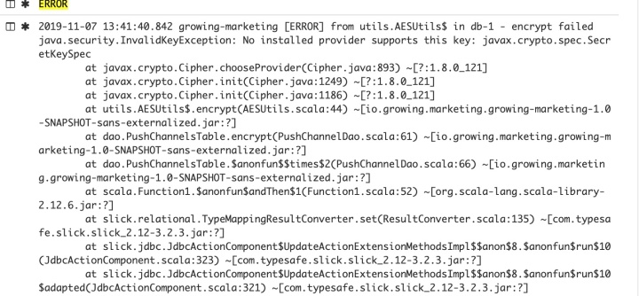
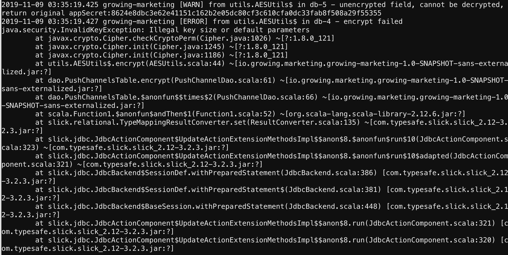

写了一个工具类用来加密解密数据库的 app字段

本地环境运行单测什么都没有任何问题，但是一到生产环境就出现 BUG。

 

这个的原因是因为线上环境没有支持 AES 算法的 Provider 需要通过改 ext 包下添加支持的第三方包或者引入第三方库解决。

我这边采用的是引入第三方库：

```scala
"org.bouncycastle" % "bcprov-jdk16" % "1.45"
```

```scala
private val localCipher: ThreadLocal[Cipher] = ThreadLocal.withInitial(() => Cipher.getInstance("AES/ECB/PKCS5Padding", new BouncyCastleProvider()))
```

这样就解决了 No installed provider supports this key 的问题。

但是提到了测试环境，又出现了问题:



显示没有合法的AES key

首先我先将 SEED 的长度设置到16个字符，本地没有问题但是测试环境仍然报错，我突然发现我的 SEED 会进行一次 SHA-256 算法的散列，随后他的字符数目会增加到 32 个。 

我们需要明确一下本地环境和线上环境的不同:

* 本地: Jdk 安全目录 含有 unlimit 的jar包，也就是支持 16 24 32 位的key
* 线上: Jdk 安全目录 只含有 limit 的jar包，只支持 16 位的key

有两种解决方式1.线上安装 unlimit 的jar包 2. 使用16位的key

因为线上是容器环境，比较难更改 jdk jar 包，所以采用第二种。

只需要将对 SEED 加密的散列算法改为 MD5 加密就行，因为MD5 会将SEED 转换为一个长度为 16 个字符的字符串。	

```groovy
import java.nio.charset.StandardCharsets
import java.security.MessageDigest

String a = "----------------"
def instance = MessageDigest.getInstance("MD5")
secret = instance.digest(a.getBytes())
new String(secret).length()
```